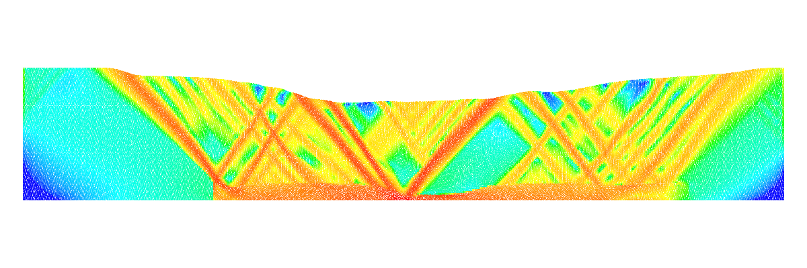
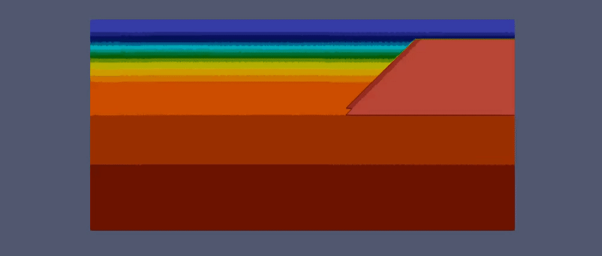

Tutorials
=========

We provide a series of docs/tutorials as Jupyter notebook:

1. `Tutorial 1 Simple Rift`_

.. image:: images/UWGeo/Tutorial1.gif
   :target: https://nbviewer.org/github/underworldcode/underworld2/tree/main/docs/UWGeodynamics/tutorials/Tutorial_1_ThermoMechanical_Model.ipynb

[Output Data](https://www.dropbox.com/s/3gy3boh9mf9s807/Tutorial1_BGH.zip?dl=0)

2. `Tutorial 2 Melt`_

[Output Data](https://www.dropbox.com/s/x03vlj03zqvu6wa/Tutorial2_BGH.zip?dl=0)

3. `Tutorial 3 Sandbox Extension`_

[Output Data](https://www.dropbox.com/s/9j24v5ex1eanro2/Tutorial3_BGH.zip?dl=0)

4. `Tutorial 4 Sandbox Compression`_

.. image:: images/UWGeo/Tutorial4.png
   :target: https://nbviewer.org/github/underworldcode/underworld2/tree/main/docs/UWGeodynamics/tutorials/Tutorial_4_NumericalSandboxCompression.ipynb

[Output Data](https://www.dropbox.com/s/4wlp3cociwysz3l/Tutorial4_BGH.zip?dl=0)

5. `Tutorial 5 Simple Compression`_

6. `Tutorial 6 Simple Surface Processes`_

6.1 `Tutorial 6.1 Surface Processes - Sedimentation & Erosion Rates`_

6.2 `Tutorial 6.2 Surface Processes - Diffusive Surface`_

7. `Tutorial 7 3D Rift`_

8. `Tutorial 8 ViscoElasticity`_

9. `Tutorial 9 Passive Margins`_

[Output Data](https://www.dropbox.com/s/g1ocpse0mld4tiy/Tutorial9_BGH.zip?dl=0)

10. `Tutorial 10 Thrust Wedge`_

.. image:: https://raw.githubusercontent.com/underworldcode/underworld2/main/docs/UWGeodynamics/tutorials/images/Tutorial_10.gif
 :target: https://nbviewer.org/github/underworldcode/underworld2/tree/main/docs/UWGeodynamics/tutorials/Tutorial_10_Thrust_Wedges.ipynb

[Output Data](https://www.dropbox.com/s/q9m37t1f09zi3xj/Tutorial10_BGH.zip?dl=0)

11. `Tutorial 11 Coupling with Badlands`_

[Output Data](https://www.dropbox.com/s/qpzrxp9fcf35w38/Tutorial11_BGH.zip?dl=0)

.. image:: images/UWGeo/Tutorial11.gif
   :target: https://nbviewer.org/github/underworldcode/underworld2/tree/main/docs/UWGeodynamics/tutorials/Tutorial_11_Coupling_with_Badlands.ipynb

.. _Tutorial 1 Simple Rift: https://nbviewer.org/github/underworldcode/underworld2/tree/main/docs/UWGeodynamics/tutorials/Tutorial_1_ThermoMechanical_Model.ipynb
.. _Tutorial 2 Melt: https://nbviewer.org/github/underworldcode/underworld2/tree/main/docs/UWGeodynamics/tutorials/Tutorial_2_Melt.ipynb
.. _Tutorial 3 Sandbox Extension: https://nbviewer.org/github/underworldcode/underworld2/tree/main/docs/UWGeodynamics/tutorials/Tutorial_3_SandboxExtension_static_mesh.ipynb
.. _Tutorial 4 Sandbox Compression: https://nbviewer.org/github/underworldcode/underworld2/tree/main/docs/UWGeodynamics/tutorials/Tutorial_4_NumericalSandboxCompression.ipynb
.. _Tutorial 5 Simple Compression: https://nbviewer.org/github/underworldcode/underworld2/tree/main/docs/UWGeodynamics/tutorials/Tutorial_5_Convergence_Model.ipynb
.. _Tutorial 6 Simple Surface Processes: https://nbviewer.org/github/underworldcode/underworld2/tree/main/docs/UWGeodynamics/tutorials/Tutorial_6_Simple_Surface_Processes.ipynb
.. _Tutorial 6.1 Surface Processes - Sedimentation & Erosion Rates: https://nbviewer.org/github/underworldcode/underworld2/tree/main/docs/UWGeodynamics/tutorials/Tutorial_6.1_sedimentation&erosion_rates.ipynb
.. _Tutorial 6.2 Surface Processes - Diffusive Surface: https://nbviewer.org/github/underworldcode/underworld2/tree/main/docs/UWGeodynamics/tutorials/Tutorial_6.2_diffusive_surface.ipynb
.. _Tutorial 7 3D Rift: https://nbviewer.org/github/underworldcode/underworld2/tree/main/docs/UWGeodynamics/tutorials/Tutorial_7_3D_Lithospheric_Model.ipynb
.. _Tutorial 8 ViscoElasticity: https://nbviewer.org/github/underworldcode/underworld2/tree/main/docs/UWGeodynamics/tutorials/Tutorial_8_Subduction_ViscoElastic.ipynb
.. _Tutorial 9 Passive Margins: https://nbviewer.org/github/underworldcode/underworld2/tree/main/docs/UWGeodynamics/tutorials/Tutorial_9_passive_margins.ipynb
.. _Tutorial 10 Thrust Wedge: https://nbviewer.org/github/underworldcode/underworld2/tree/main/docs/UWGeodynamics/tutorials/Tutorial_10_Thrust_Wedges.ipynb
.. _Tutorial 11 Coupling with Badlands: https://nbviewer.org/github/underworldcode/underworld2/tree/main/docs/UWGeodynamics/tutorials/Tutorial_11_Coupling_with_Badlands.ipynb
